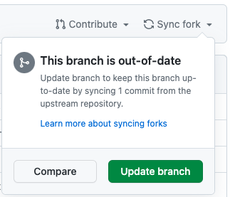

#  Fork Syncer

## What does it do?
For the logged-in GitHub user, syncs all forked repositories with the default branch of their upstream parent.

This is analogous to syncing the fork via the GitHub UI for all forked repositories:



## Usage

```shell
./fork-syncer.sh
```